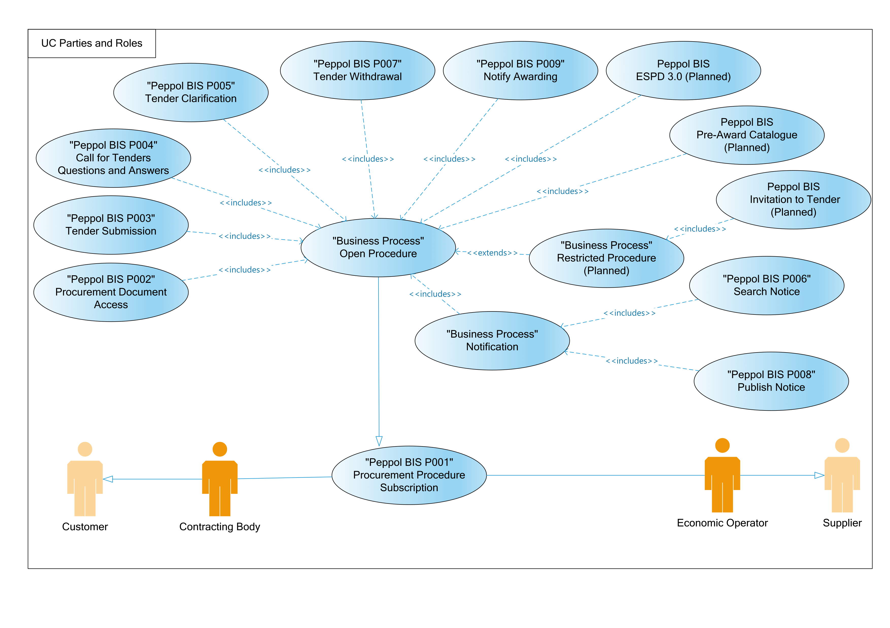

= Parties and roles

The following business partners participate in this profile, acting in the roles as defined below.

[cols="2,5,5", options="header"]
.Parties
|===
| Party
| Description
| Example of roles
| *Customer*
| The Customer is the legal person or organization who is in demand of a product or service.
| Examples of customer roles are Buyer, Consignee, Debtor and contracting body.
| *Supplier*
| The Supplier is the legal person or organization who provides a product or service.
| Examples of Supplier roles are Seller, Consignor, Creditor and economic operator.
|===

[cols="2,10", options="header"]
.Roles
|===
| Role
| Description
| *Contracting body*
| The Contracting Authority or Contracting Entity who is buying supplies, services or tendering public works.
| *Economic operator*
| Party participating with a bid in a procurement process to sell goods, services or works.
|===

