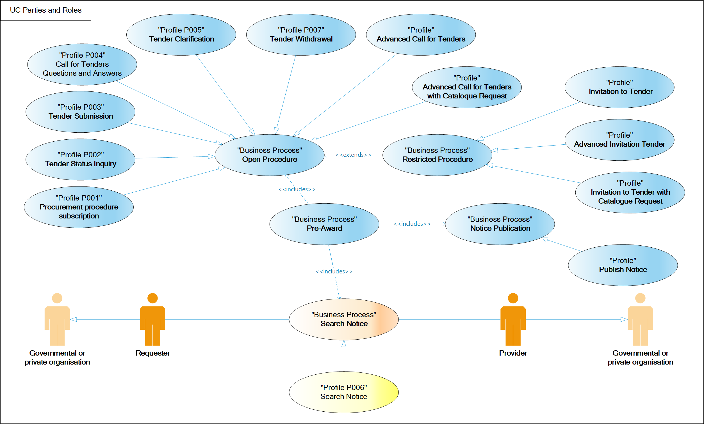

= Parties and roles

The following parties participate as business partners in this transaction, acting in the roles as defined below

[cols="5,10", options="header"]
.parties
|===
| Business Partner
| Description
| *Governmental or private organization*
| Any organisation.
|===

[cols="2,10", options="header"]
.roles
|===
| Role
| Description
| *Requester*
| A service or economic operator in search of opportunities.
| *Provider*
| A data service that discloses information on notices (whether governmental or a private organisation).
|===

NOTE: Also other bodies than economic operators may need to search for notices, such as a statistics office or scholars. This profile particularly focuses on the tendering process, involving involving tendering platforms that are operated for economic operators. However, the search process and the transactions described in this profile may not necessarily be used by economic operators alone.

