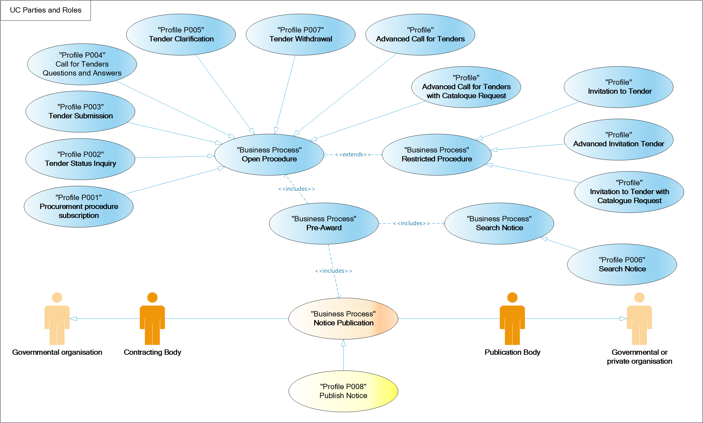

= Parties and roles

The following parties participate as business partners in this transaction, acting in the roles as defined below

[cols="5,10", options="header"]
.parties
|===
| Business Partner
| Description
| *Governmental or private organization*
| Any organisation.
| *Governmental organization*
| A body governed by public law, meaning bodies:

(a) established for the specific purpose of meeting needs in the general interest, not having an industrial or commercial character;

(b) having legal personality; and

(c) financed, for the most part, by the State, regional or local authorities, or other bodies governed by public law; or subject to management supervision by those bodies; or having an administrative, managerial or supervisory board, more than half of whose members are appointed by the State, regional or local authorities, or by other bodies governed by public law.

|===

[cols="2,10", options="header"]
.roles
|===
| Role
| Description
| *Publication Body*
| A Pan-European, national or regional organisation that publishes procurement notices of a contracting body. While the basic role of the publisher may apply to any newspaper, other roles and functions are often restricted to official gazettes. These gazettes are also often responsible to ensure a formal verification of the notices in respect of legislative or other requirements in vigour. Official gazettes may also have the role to receive information exempted from publication (e.g. due to confidential content) used for notification to a supervising authority. I.e. eNotification also covers notification of authorities in the context of public procurement notices, e.g. for transparency and control reasons.
| *Contracting Body*
| The State, regional or local authorities, bodies governed by public law, associations formed by one or several of such authorities or one or more such bodies governed by public law, contracting Economic Operators for supply of goods, services or works. This term has a narrower scope than the term “Customer” and is in BII treated as a customer role.
|===

