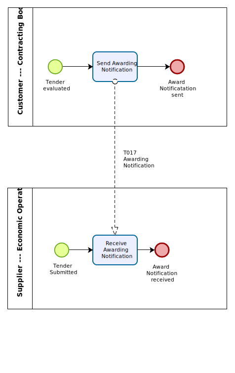

= Business process

The {link-bpmn}[BPMN] diagram shows the choreography of the business process implemented by the {name-profile}. The choreography of business collaborations defines the sequence of interactions when the profile is run within its context.

[cols="2,10", options="header"]
.Business process
|===
| Category | Description
| Description | The contracting body sends an awarding notification to all economic operators that have tendered.

| Pre-conditions | The contracting body has awarded the contract to a tendering economic operator.
| Post-conditions | All tendering economic operators have been informed about the awarding of the contract by the contracting body.

|===

[cols="3,2,7", options="header"]
.Role description
|===
| Activity | Role involved | Description
| Send Awarding Notification | Contracting body | The contracting body sends an awarding notification to all economic operators that have tendered.
| Receive Awarding Notification | Economic operator | The economic operator receives the awarding notification.

|===

include::implementation-guidelines.adoc[]

