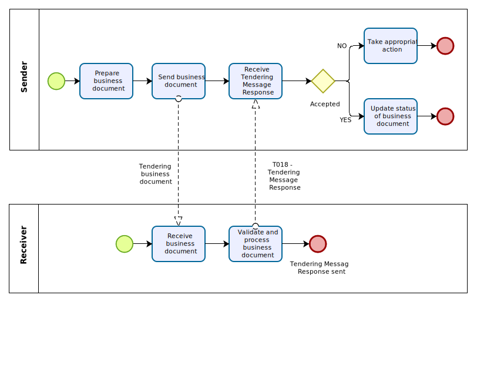

= Business process description

The process starts when a BusinessDocumentSender is preparing an electronic business document and then sends it. The BusinessDocumentReceiver receives the business document, potentially validates syntax and business rules and starts to process the business document.

* In case the BusinessDocumentSender has the capability to receive a TMR, the BusinessDocumentReceiver either:

** Validates the business document and based on the result returns either an accept (no fatal errors and no processing exceptions found), a conditional accept (warnings found) or a reject (fatal errors or processing exception found)

** Doesn’t validate the business document and does not find any processing exceptions and just sends an accept to the sender of the business document.

* If a TMR is returned to the BusinessDocumentSender, it may take appropriate action.

** If the response is positive the BusinessDocumentSender may update the status of the business document or simply ignore the TMR.

** If the response is negative the BusinessDocumentSender may be able to fix the issue and sent an updated version of electronic business document.

** If the response is accepted conditionally the BusinessDocumentSender may be able to analyse and fix the issue for future applications.

.Business Process Tendering Message Response

The {link-bpmn}[BPMN] diagram above shows the choreography of the business process implemented by the TMR. The choreography of business collaborations defines the sequence of interactions when the {name-profile}  is excecuted.

[cols="2,10", options="header"]
.Business process

|===
| Category | Description
| Description
| A receiver of a business document sends a TMR if the sender of the business document supports the TMR.
| Pre-conditions |
(1)	A faulty business document was received by the Receiver

(2)	A correct business document was received by the Receiver
| Post-conditions	|
(1)	A negative TMR was sent to the sender of the business document and the sender takes appropriate actions

(2)	A positive TMR was sent to the sender of the business document and the business process continues

|===

