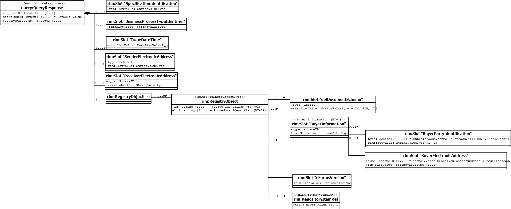

== Data model diagram

The following transaction data model illustrates the classes and information elements of {name-transaction}.

== XML example

The following XML example illustrates the structure of an instance of {name-transaction}.

link:{xml-doc-file}[Link to example file]

[source,xml,role="hide-callouts"]
.Example file for {name-transaction}
----
include::../files/ExampleSearchNoticeResponse.xml[tag=**]
----
