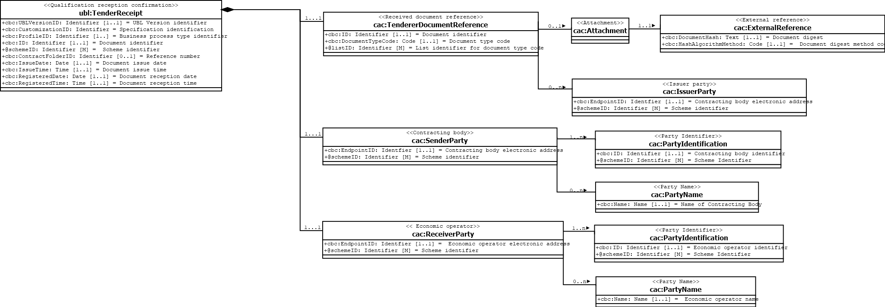

== Data model diagram

The following transaction data model illustrates the classes and information elements of {name-transaction}.

== XML example

The following XML example illustrates the structure of an instance of {name-transaction}.

Link to {examples-zip}

[source,xml,role="hide-callouts"]
.Example file for {name-transaction}
----
include::{examples-dir}/QualificationResponse-doc.xml[tag=**]
----
